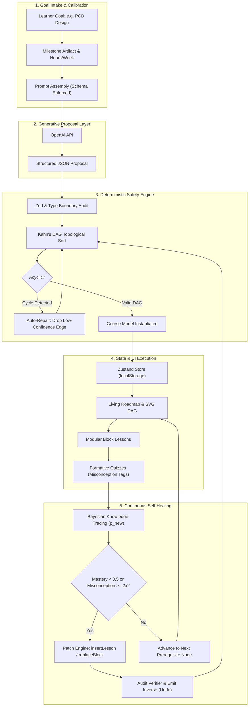
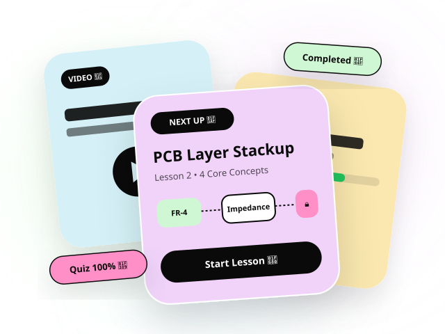

# AnyLearn

> 🚀 **Live Deployed Application:** **[https://anylearn-eight.vercel.app](https://anylearn-eight.vercel.app)**  
> 🎬 **Screen Recording & Pitch Walkthrough:** **[Google Drive Video Folder](https://drive.google.com/drive/folders/1luywo5jKaEEn2Ot7bPYWSODBeXG0-lAg?usp=sharing)**

## Overview

**AnyLearn** is a living, adaptive learning platform engineered for **ONE learner and ONE goal**. Instead of forcing learners into generic, static playlists, AnyLearn generates a customized curriculum structured as an acyclic concept dependency graph (DAG), produces block-based interactive lessons with worked examples, assesses comprehension through contextual quizzes, and dynamically patches the curriculum in real time using a deterministic Bayesian Knowledge Tracing (BKT) engine.

Built under the guiding architecture of **"AI proposes, the engine disposes,"** AnyLearn pairs generative AI models with strict schema validation and deterministic state transitions, guaranteeing that generated learning paths remain mathematically coherent, verifiable, and completely private.

---

## Problem Statement

Self-directed learners face three major roadblocks with existing learning solutions:

1. **Static, One-Size-Fits-All Curriculums:** Traditional courses and MOOCs follow rigid, linear sequences that ignore a learner's prior knowledge, unique pace, and specific milestone goals. Learners waste time on concepts they already know or get stranded when foundational prerequisites are missing.
2. **Unstructured AI Chatbots:** While LLMs are knowledgeable tutors, free-form chat interfaces lack curricular scaffolding, visual progress tracking, and structured milestone enforcement. Users easily lose context, drift off-track, or receive unverified explanations with no accountability.
3. **No Self-Healing When Content Fails:** In standard LMS platforms, if a lesson contains a confusing explanation, an outdated snippet, or a sudden difficulty spike, the learner has no immediate recourse and often abandons the course entirely.

---

## Solution

AnyLearn solves these challenges by combining generative curriculum intelligence with deterministic graph theory and Bayesian mastery modeling:

- **Goal-Calibrated Learning Graphs:** AnyLearn accepts any ambitious learning goal (e.g., *Medical Terminology & Clinical Basics*, *PCB Design from Zero*, *Rust Systems Programming*) along with a desired end artifact and weekly commitment, synthesizing an atomic Concept DAG and module hierarchy.
- **Deterministic Bayesian Mastery Engine:** Instead of trusting an LLM to guess learner competence, AnyLearn tracks atomic concept mastery probabilities ($P(\text{mastery})$) through quiz interactions. When misconceptions repeat or scores dip below thresholds, the engine flags weaknesses.
- **Autonomous Curriculum Patching:** The deterministic `PatchEngine` applies atomic, schema-validated mutations (`insertLesson`, `replaceBlock`, `addPractice`, `markSkippable`) to heal knowledge gaps, complete with version control and instant undo capabilities.
- **In-Browser Diagnostic Engine ("Report / Fix"):** Learners can flag any confusing block or prerequisite gap. A dual-model diagnose-and-verify pipeline repairs the content in ~15 seconds while preserving existing progress.
- **Client-Side Privacy First:** API keys and learner progress are maintained directly in browser storage (`localStorage`), ensuring zero telemetry, zero server-side key logging, and instantaneous response times.

---

## System Architecture & Graphs

### 1. End-to-End System Data Flow


### 2. Concept Dependency Graph (DAG) Structure

```mermaid
graph LR
    subgraph M1 ["Module 1: Electronics Fundamentals"]
        C1(["Ohm's Law & Power"]) --> C2(["Passive Components"])
        C2 --> C3(["Voltage Dividers"])
    end

    subgraph M2 ["Module 2: Schematic Capture"]
        C3 --> C4(["Symbol Libraries"])
        C4 --> C5(["Netlists & Buses"])
    end

    subgraph M3 ["Module 3: Board Layout & Routing"]
        C3 --> C6(["Ground Planes & Return Paths*"])
        C5 --> C7(["Footprint Assignment"])
        C6 --> C8(["Trace Impedance & Routing"])
        C7 --> C8
    end

    subgraph M4 ["Module 4: Fabrication & DRC"]
        C8 --> C9(["Design Rule Checking (DRC)"])
        C9 --> C10(["Gerber Export & Fab Review"])
    end

    classDef completed fill:#00F59B,stroke:#000000,stroke-width:2px,color:#000000;
    classDef active fill:#FFE600,stroke:#000000,stroke-width:2px,color:#000000;
    classDef adapted fill:#FF5A36,stroke:#000000,stroke-width:2px,color:#FFFFFF;
    classDef normal fill:#FFFFFF,stroke:#000000,stroke-width:2px,color:#000000;

    class C1,C2,C3 completed;
    class C4,C5 active;
    class C6 adapted;
    class C7,C8,C9,C10 normal;
```

*(Legend: 🟩 **Completed Node** · 🟨 **Active Focus** · 🟥 **Adaptive Remedial Node Inserted by Engine** · ⬜ **Upcoming Prerequisite**)*

### 3. Self-Healing & Diagnostic Verification Loop
```mermaid
sequenceDiagram
    autonumber
    actor Learner
    participant UI as Lesson Workspace / Report Page
    participant Store as Zustand State Store
    participant Diagnoser as AI Diagnoser (Root Cause)
    participant Verifier as AI Verifier (Independent Audit)
    participant PatchEng as Deterministic PatchEngine

    Learner->>UI: Flags confusing block / reports missing prerequisite
    UI->>Store: Assembles context bundle (Lesson, Concept DAG, Mastery)
    Store->>Diagnoser: Requests FixPlan with schema bounds
    Diagnoser-->>Store: Returns proposed patch (max 3 ops)
    Store->>Verifier: Audits claims & verifies pedagogical safety
    alt Fix Verified
        Verifier-->>Store: Verdict: ACCEPTED
        Store->>PatchEng: applyPatch(patch)
        PatchEng->>PatchEng: Validates DAG & Generates Inverse Patch
        PatchEng-->>Store: Course version incremented (v+1)
        Store-->>UI: Live update applied with Undo option
        UI-->>Learner: Course healed in ~15s (Notification Toast)
    else Fix Rejected
        Verifier-->>Store: Verdict: REJECTED (Issues Flagged)
        Store-->>UI: Marked for human review; current state preserved
    end
```

---

## Features

* **🎯 Adaptive Goal & Calibration Intake:** Define any learning target, select a concrete milestone artifact (e.g., *Working Prototype*, *Deep Understanding*), and set weekly commitment hours to generate a tailored curriculum.
* **🗺️ Living Roadmap & Interactive DAG Graph:** Seamlessly switch between a clean modular curriculum list and an SVG concept dependency graph showing prerequisite edges, module clusters, completion status, and active lesson indicators.
* **📖 Block-Based Modular Lessons:** Lessons are broken down into bite-sized objectives, step-by-step worked examples, interactive knowledge checkpoints, common mistake callouts, and hands-on application tasks.
* **⚡ Contextual Quizzes & Misconception Tracking:** Formative multiple-choice questions generated directly from lesson content. Every distractor option is mapped to a specific misconception, providing instant feedback and updating concept mastery.
* **🔄 Self-Healing Patch Engine with Full Undo:** When a learner struggles, the engine dynamically patches the course by inserting prerequisite refresher lessons or additional practice tasks—all tracked in an immutable course changelog.
* **🛠️ One-Click "Report / Fix" Engine:** Spot an error or confusing section? Submit a report targeting a specific lesson block; an automated AI diagnose-and-verify workflow patches the lesson and verifies the fix in seconds.
* **🎨 High-Contrast Neo-Brutalist Interface:** Designed with authentic Neo-Brutalism aesthetics—bold 3px black borders, crisp 4px/6px drop shadows, pure black high-contrast typography, and tactile micro-interactions.
* **🔒 Privacy-Preserving & Demo-Ready:** Fully functional offline or with client-side API keys. Includes pre-packaged curriculum fixtures (Medical Terminology & PCB Design) for immediate evaluation without requiring credentials.

---

## Tech Stack

* *Frontend:* Next.js 16 (App Router), React 19, TypeScript, Vanilla CSS (Custom Neo-Brutalist Design System)
* *Backend:* Next.js Serverless Edge / Route Handlers, Node.js
* *Database:* Client-side Zustand state store with `localStorage` persistence and hydration safety
* *APIs / Services:* OpenAi Api, Codex, Google Generative AI REST API (Structured JSON Schema generation and diagnostic verification)
* *Hosting / Deployment:* Vercel / Netlify / Self-hosted Docker container
* *Other Tools:* Native Node Test Runner (`node:test`), Mermaid.js (DAG visualization), Framer Motion, Canvas Confetti

---

## Codex / OpenAI Usage

AI development tools and LLM integrations played a central role throughout the lifecycle of AnyLearn:

* **Ideation & System Modeling:** AI was utilized to model the core architectural philosophy: *"AI proposes, the engine disposes."* This established a strict boundary where generative models produce structured JSON proposals while deterministic TypeScript engines enforce invariants, acyclic DAG rules, and Bayesian probabilities.
* **Architecture & Schema Planning:** Used AI assistance to draft type-safe TypeScript interfaces for atomic concept graphs, multi-type lesson blocks (worked examples, checkpoints, callouts), quiz distractors with misconception tags, and reversible `RoadmapPatch` operations.
* **Core Engine Implementation:** Accelerated the implementation of the Bayesian Knowledge Tracing calculation ($p_{\text{new}} = p_{\text{old}} + \alpha \cdot (\text{score} - p_{\text{old}})$) and the topological sorting algorithm used to detect and resolve cycles in curriculum prerequisites.
* **UI/UX Development:** Rapidly generated and refined Neo-Brutalist CSS utility tokens, responsive grid layouts (`.brutal-grid-4`), tactile button depression states, and SVG graph rendering logic.
* **Comprehensive Test Suite Generation:** Formulated an automated 80-test regression and boundary test suite covering course generation, patch idempotency, store immutability, undo invariants, and SSR/CSR hydration safety.
* **Documentation & Prompts Engineering:** Structured zero-shot and few-shot system prompts with schema enforcement to guarantee reliable JSON outputs across calibration, lesson expansion, quiz generation, and patch diagnosis.

---

## Demo

### 🚀 Live Deployed Project

👉 **[Launch AnyLearn on Vercel: https://anylearn-eight.vercel.app](https://anylearn-eight.vercel.app)**  
*Live, interactive, and zero-configuration ready with full offline curriculum fixtures and Gemini API support.*

### 🎬 Screen Recording & Pitch Video

👉 **[Watch Screen Recording & Pitch Demo (Google Drive Folder)](https://drive.google.com/drive/folders/1luywo5jKaEEn2Ot7bPYWSODBeXG0-lAg?usp=sharing)**  
*Complete walkthrough showcasing course goal generation, DAG roadmaps, interactive lessons, quizzes, and Bayesian adaptation.*

---

## Screenshots

| Curriculum Roadmap | Concept DAG Visualization |
| :---: | :---: |
|  |  |
| *Neo-Brutalist curriculum dashboard with live metrics* | *Interactive SVG dependency graph with prerequisite nodes* |

| Interactive Lesson View | Misconception-Driven Quiz |
| :---: | :---: |
|  |  |
| *Block-based lessons with worked examples and checkpoints* | *Formative quizzes with instant feedback and mastery updates* |

---

## How to Run Locally

### Prerequisites
- Node.js 20.0 or higher
- npm 10.0 or higher

### Installation & Setup

1. **Clone the repository:**
   ```bash
   git clone https://github.com/your-username/AnyLearn.git
   cd AnyLearn
   ```

2. **Install dependencies:**
   ```bash
   npm install
   ```

3. **Start the local development server:**
   ```bash
   npm run dev
   ```

4. **Access the application:**
   Open [http://localhost:3000](http://localhost:3000) in your web browser.

5. **Run the test suite:**
   To run all 80 automated unit, integration, and regression tests:
   ```bash
   npm test
   ```

6. **Create a production build:**
   ```bash
   npm run build
   ```

---

## Additional Notes

* **Zero Mock Data Invariant:** Every component across the dashboard, roadmap, lesson workspace, quiz runner, and diagnostic reporter operates on live Zustand state backed by real Bayesian updates. There are no placeholder metrics or dummy data.
* **Out-of-the-Box Fixtures:** For instant exploration without an API key, the platform automatically initializes with a rich *Medical Terminology & Clinical Basics* course fixture, and includes an alternate *PCB Design from Zero* curriculum switchable via the in-app Settings modal.
* **Deterministic Guardrails:** The patch engine enforces strict safety limits—a maximum of 3 operations per patch, an absolute prohibition against deleting completed lessons, and mandatory acyclic DAG verification before any patch is committed.
* **Future Horizons:** Upcoming enhancements include multi-modal audio summaries, automated verification of external resource links via YouTube oEmbed protocols, and exportable learner portfolios.
